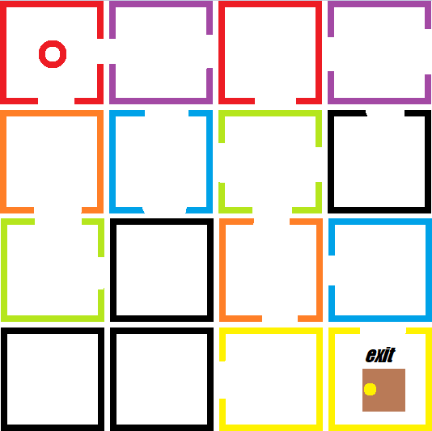

# Rooms!

## *Simple logic game that doesn't really aspire to be AAA title anywhere soon*

The main goal of the game, is to find a way to the exit door.
This however might be not that easy, because door, aren't always in our way.
To make your way out, and be closer to the goal, a player has to rotate the room that he is actually occupying.

The catch: Rooms are colored. By rotating (for example) red room, another one that is red too, will also rotate!

For the present moment these are the steps I need to take, to build working game:
- [ ] Design working room  model class (randomizing the color, and its configuration)
- [ ] Design player class 
- [ ] Design levels: experiment with rules, create some fancy obstacles?
- [ ] Test it out with second player in realtime
- [ ] Eye-candy: animations and GLSL based graphic effects?

---

---
